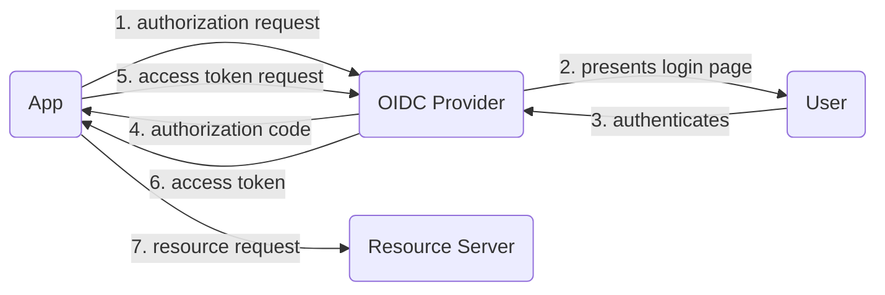

```mermaid
flowchart LR
    C(App) -->|1. authorization request|A(OIDC Provider)
    A-->|2. presents login page|O
    O(User)-->|3. authenticates|A
    A-->|4. authorization code|C
    C-->|5. access token request|A
    A-->|6. access token|C
    C-->|7. resource request|S(Resource Server)
```